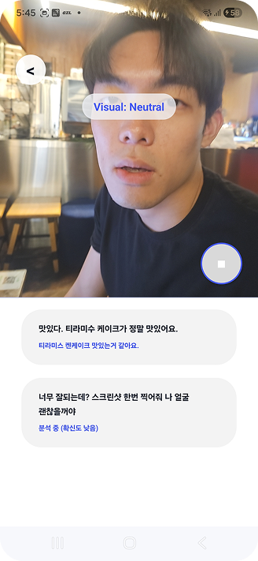
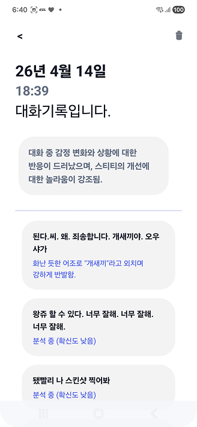

# MUTON

> 농인·난청인을 위한 실시간 대화 보조 시스템 — 단순 자막을 넘어 **표정·음성 맥락·대화 흐름**까지 요약해 상황과 감정의 뉘앙스를 전달합니다.

가천대학교 졸업 팀 프로젝트 

> AI 모델 학습·백엔드 서버 로직은 팀원이 맡았으며, 아래에서 제 기여 범위는 Android 클라이언트 전반 — UI, Firebase 인증(회원가입/로그인), 백엔드 API 연동 입니다.
>
> 원본: [Ai-pre/MUTON](https://github.com/Ai-pre/MUTON) · Android 원본: [Ai-pre/MUTON-Android](https://github.com/Ai-pre/MUTON-Android)
> 본 레포는 분리되어 있던 백엔드/AI·Android 레포를 하나로 묶은 포트폴리오용 통합 정리본입니다.

---

## 데모

| 실시간 자막 | 대화 기록 · 요약 |
|:---:|:---:|
|  |  |
| 카메라 위에 표정 태그(`Visual: Neutral`)와 실시간 발화 자막을 함께 표시. 요약 신뢰도가 낮으면 **`분석 중 (확신도 낮음)`** 상태로 노출. | 날짜별 대화 기록과 상단 상황 요약. 각 발화의 감정·태도 묘사를 확신도와 함께 저장(Firebase). |

---

## 풀려는 문제

기존 음성→자막 도구는 **"무슨 말을 했는지"**는 알려주지만 **"어떤 상황·감정이었는지"**는 놓칩니다. 농인·난청인은 화자의 표정, 말의 톤, 대화의 맥락을 종합한 정보가 필요합니다.

MUTON은 카메라·마이크 입력을 받아:
1. **음성 → 텍스트** (Whisper STT)
2. **표정 + 음성 맥락 + 대화 흐름**을 멀티모달로 요약 (Qwen2.5-Omni + LoRA)
3. Android 화면에 **실시간 자막과 상황 요약**을 함께 표시

합니다.

---

## 시스템 구조

```
[Android 클라이언트]                 [FastAPI 백엔드]
 카메라/오디오 캡처  ──스트리밍──▶   Whisper STT
 실시간 자막 표시    ◀──결과────    Qwen2.5-Omni (LoRA) 멀티모달 요약
 요약 화면                          ROUGE-L / 지연시간 평가
```

- `android/` — Kotlin 클라이언트 (캡처, 실시간 자막, 요약 화면)
- `backend/` — FastAPI 서버, STT, 멀티모달 처리, 학습 스크립트
- `docs/` — 설계 노트, 포트폴리오 문서

---

## 내가 담당한 부분 (Android 클라이언트 전반)

- **UI/화면 설계 및 구현**: 실시간 자막 화면 ↔ 대화 요약 화면 전환 등, 사용 시나리오에 맞춘 화면 흐름 전체
- **Firebase 인증**: 회원가입·로그인 등 사용자 인증/관리 기능 구현 (Firebase Auth) — 클라이언트에서 사용자 상태를 관리하고 인증 흐름을 처리
- **백엔드 API 연동**: FastAPI 엔드포인트와의 요청/응답 연동 구현. 백엔드 처리 단계(STT → 멀티모달 요약)의 흐름을 이해하고, 응답을 화면 표시 타이밍에 맞춰 렌더링
- **실시간 캡처 파이프라인**: 카메라/오디오 입력을 캡처해 백엔드로 전송하고, 결과를 끊김 없이 자막으로 갱신

> AI 모델 학습·서버 로직은 직접 작성하지 않았지만, **인증·API 연동·실시간 표시**까지 클라이언트–백엔드 경계를 책임지며 전체 시스템 흐름을 이해하고 있습니다.

> Firebase 설정 파일(`google-services.json` 등)은 보안상 포트폴리오 아카이브에서 제외했습니다.

---

## 기술 스택

| 영역 | 기술 |
|---|---|
| Android | Kotlin, Camera/Audio 캡처, 실시간 자막 렌더링 |
| 백엔드 | FastAPI |
| STT | OpenAI Whisper |
| 멀티모달 요약 | Qwen2.5-Omni + LoRA 파인튜닝 |
| 평가 | ROUGE-L, 지연시간 측정, 사람 평가 |

---

## 평가 (팀 성과)

요약 품질과 실시간성을 함께 측정했습니다. 핵심 비교는 **베이스 모델 vs LoRA 적응 모델**(Qwen2.5-Omni-7B).

**요약 품질** — LoRA 적응 후 모든 입력 조합에서 향상 (샘플 30):

| 모델 | ROUGE-L F1 (최고) | 사람 평가 (총점 /20) |
|---|---:|---:|
| Qwen2.5-Omni Base | 0.0265 | 10.73 |
| Qwen2.5-Omni + LoRA | **0.1616** (Text+Face) | **16.60** |

- 30쌍 비교에서 **29쌍이 LoRA 출력을 더 우수**하다고 평가
- 가장 큰 차이는 자연스러움(fluency): 베이스는 챗봇식 장황한 응답, LoRA는 자막용 짧은 관찰형 문장

**실시간성** — 라이브 Android 서비스 기준 지연:

| 항목 | 샘플 | 평균 지연 |
|---|---:|---:|
| STT 서버 처리 | 300 | 1.41s |
| 모바일 end-to-end (발화 종료 → 요약 표시) | 10 | 5.6s |

> ROUGE-L은 짧은 한국어 묘사 특성상 **절대 점수가 아닌 상대 비교 지표**로 해석했고, dev-set 비교라 최종 일반화 주장이 아닌 베이스/LoRA 행동 비교용입니다. (자세한 수치·정성 예시: [backend/docs/EVALUATION_RESULTS.md](backend/docs/EVALUATION_RESULTS.md))

---

## 회고

Android 담당으로서 가장 크게 부딪힌 건 **end-to-end 지연**이었습니다. 모델 자체 추론은 2~3초대였지만, 실제 모바일에서는 발화 종료(VAD) → 오디오/영상 전송 → STT → 요약 생성 → 네트워크 응답 → UI 갱신까지 누적되며 평균 **5.6초**가 걸렸습니다. 클라이언트에서 체감 지연을 줄이려고 캡처/전송과 화면 갱신 타이밍을 조정했지만, 병목은 클라이언트 단독이 아니라 **파이프라인 전체에 분산**되어 있어 백엔드와 응답 포맷·청크 단위를 함께 맞춰야 했습니다.

이 과정에서 "클라이언트만 잘 만든다"가 아니라 **클라이언트–서버 계약(요청/응답 구조, 지연 특성)을 같이 설계해야 실시간 서비스가 성립한다**는 걸 배웠습니다. 다시 한다면 처음부터 스트리밍 응답(부분 결과 우선 표시)을 전제로 화면을 설계해, 최종 요약을 기다리는 동안에도 사용자에게 중간 자막을 보여주는 구조로 갔을 것입니다.

---

## 실행 방법

### 백엔드

```bash
cd backend
pip install -r requirements.txt
pip install -r requirements-qwen-omni.txt
python scripts/run_qwen_server.py
```

모델 자산, LoRA 어댑터 경로, API 키는 로컬에서 별도 설정이 필요합니다. 자세한 원본 설정은 [backend/README.md](backend/README.md) 참고.

### Android 클라이언트

`android/`를 Android Studio에서 열거나 커맨드라인으로 빌드:

```powershell
cd android
.\gradlew.bat :app:assembleDebug
```

Firebase 기반 로그인/기록 기능을 쓰려면 `android/app/google-services.example.json`을 `android/app/google-services.json`으로 복사한 뒤 로컬 Firebase 프로젝트 설정을 채우세요. 실제 설정 파일은 보안상 이 아카이브에서 제외(.gitignore)되어 있습니다.

---

## 참고

- 본 레포는 학내 팀 프로젝트의 포트폴리오 아카이브이며, 별도 재배포본이 아닙니다.
- 런타임 URL, 모델 경로, API 키, 터널 설정은 라이브 데모 전에 각자 구성해야 합니다.
