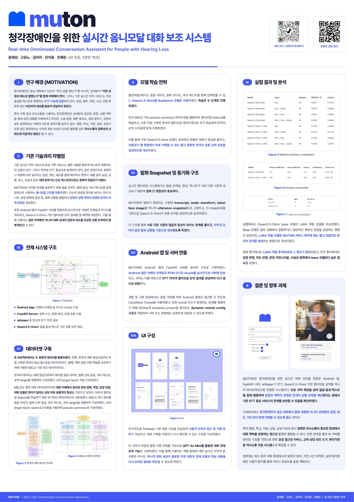

# MUTON

MUTON is a real-time omnimodal conversation assistant for people with hearing loss. It extends ordinary speech-to-text by combining speech, facial expression, and dialogue context so that users can read not only what was said, but also the speaker's tone, attitude, and situation.

<p align="center">
  
</p>

## Contents

- [Overview](#overview)
- [Project At A Glance](#project-at-a-glance)
- [Motivation](#motivation)
- [System Pipeline](#system-pipeline)
- [Key Results](#key-results)
- [Installation](#installation)
- [Prepare Runtime Assets](#prepare-runtime-assets)
- [Prepare Datasets](#prepare-datasets)
- [Training / Adaptation](#training--adaptation)
- [Running The Server](#running-the-server)
- [API Reference](#api-reference)
- [Evaluation](#evaluation)
- [Limitations & Roadmap](#limitations--roadmap)
- [Android Integration](#android-integration)
- [Repository Structure](#repository-structure)
- [Wiki & Documentation](#wiki--documentation)
- [License](#license)

## Overview

The current recommended runtime uses `OpenAI whisper-1` for Korean speech-to-text and `Qwen2.5-Omni + ko_stage LoRA` for multimodal summary generation. This split is intentional: STT is handled by a stable transcription backend, while multimodal reasoning is handled by a pretrained omni model that can use visual, audio, and text context together.

The repository also keeps the earlier P-project pipeline, including face/audio/text encoders and custom fusion models. Those files are maintained as experiment history and comparison baselines, while the current mobile demo path is based on the Qwen server.

## Project At A Glance

| Area | Current Implementation |
|---|---|
| Target users | Hearing-impaired users who rely on oral communication and need context beyond plain subtitles |
| Client | Android app for camera/audio capture, subtitles, visual emotion cues, and conversation record screens |
| Backend | FastAPI server exposed through Cloudflare Tunnel |
| STT | OpenAI `whisper-1` |
| Summary model | `Qwen2.5-Omni-7B` with `ko_stage` LoRA adapter |
| Training strategy | Two-stage LoRA adaptation: MELD pseudo-summary stage followed by Korean dataset adaptation |
| Android repository | [Ai-pre/MUTON-Android](https://github.com/Ai-pre/MUTON-Android) |

## Motivation

Most captioning services answer only one question: what was said. Real conversation also depends on how it was said, including facial expression, hesitation, tone, emphasis, and the surrounding dialogue flow. MUTON was built to reduce this gap by turning multimodal signals into a more useful communication aid for real-time mobile situations.

In P-project, the main goal was to design a multimodal fusion model directly. In Graduation Project 2, the focus shifted toward a more practical service architecture: using stronger pretrained multimodal models, improving STT reliability, synchronizing utterance-level inputs, and connecting the backend to an Android client that can be used in a live demo.

## System Pipeline

The current pipeline separates low-latency transcription from multimodal summary generation. Audio chunks are buffered and segmented into utterances, video frames are processed for face/emotion context, and committed utterance snapshots are passed to the Qwen-based summary path.


## Key Results

| Evaluation | Result |
|---|---:|
| Best automatic summary score | `Qwen2.5-Omni + LoRA`, Text + Face, ROUGE-L F1 `0.1616` |
| Full input summary score | `Qwen2.5-Omni + LoRA`, Text + Face + Audio, ROUGE-L F1 `0.1405` |
| Human evaluation score | Base `10.73 / 20`, LoRA `16.60 / 20` |
| STT server latency | 300 samples, average `1.4071s` |
| Mobile end-to-end latency | 10 live Android utterances, average `5.6s` |

ROUGE-L is treated only as a relative automatic metric because MUTON generates short open-ended Korean emotion and situation summaries. The current reference summaries are pseudo-labels, so the strongest evidence is the relative Base vs LoRA comparison and qualitative output change rather than an absolute benchmark score.

## Installation

```bash
pip install -r requirements.txt
pip install -r requirements-qwen-omni.txt
```

Recommended runtime requirements:

- Python environment with CUDA-capable PyTorch
- FastAPI and Uvicorn for the backend server
- Hugging Face Transformers, Accelerate, and PEFT for Qwen2.5-Omni
- MediaPipe for face landmark processing
- OpenAI API access for `whisper-1` STT and server-side conversation record summaries
- Cloudflare Tunnel for exposing the local backend to the Android app

## Prepare Runtime Assets

The Qwen runtime expects the base model dependencies and the trained LoRA adapter path to be available on the server.

```bash
export OPENAI_API_KEY=YOUR_OPENAI_API_KEY
export MUTON_QWEN_ADAPTER=/path/to/out/qwen_omni_lora/ko_stage
export MUTON_QWEN_STT_BACKEND=openai
```

Optional runtime switches:

- `MUTON_QWEN_STT_BACKEND=openai` uses OpenAI `whisper-1`.
- `MUTON_QWEN_STT_BACKEND=local` uses the local Korean Whisper fallback.
- `MUTON_RECORD_SUMMARY_MODEL=gpt-4o` controls the server-side record summary model.

## Prepare Datasets

MUTON uses two dataset directions:

- Korean multimodal samples built from conversation videos, aligned face crops, audio utterances, transcripts, and summary targets.
- MELD-based auxiliary samples reconstructed through utterance matching, Korean translation, representative frame/audio extraction, and pseudo-summary generation.

For the MELD path, `Qwen/Qwen3.5-9B` was used only as a pseudo-label teacher. It generated Korean target summaries from the translated transcript and a representative face frame. The extracted audio was not passed to this teacher; it was added later as an input when training the `Qwen2.5-Omni-7B` student model. The resulting official-split exports contain 5,353 training samples and 636 development samples.

Dataset-related scripts:

```text
scripts/build_rich_ko_dataset.py
scripts/build_rich_meld_dataset.py
scripts/generate_meld_pseudo_summaries.py
scripts/export_qwen_omni_ko_dataset.py
scripts/export_qwen_omni_meld_dataset.py
src/qwen_omni_dataset.py
```

The P-project dataset format was feature-oriented for a custom fusion Transformer. Graduation Project 2 added JSONL-style multimodal message samples so that image, audio, and text inputs could be adapted to the Qwen2.5-Omni workflow.

## Training / Adaptation

The current branch keeps both legacy fusion experiments and Qwen adaptation scripts.

```text
scripts/train_fusion_seq2seq.py
scripts/train_fusion_seq2seq_two_stage.py
scripts/train_rich_fusion_seq2seq.py
scripts/train_qwen_omni_lora.py
scripts/train_qwen_omni_lora_two_stage.py
```

The recommended Graduation Project 2 path is two-stage Qwen2.5-Omni LoRA adaptation: Stage A uses the MELD pseudo-summary dataset, and Stage B adapts the resulting model to the directly constructed Korean dataset. Qwen3.5-9B is a data-generation teacher, not the runtime summary model. The legacy fusion models remain useful for explaining the project transition from direct encoder fusion to pretrained omnimodal generation.

## Running The Server

Start the Qwen backend:

```bash
export LANG=C.UTF-8
export LC_ALL=C.UTF-8
export PYTHONIOENCODING=utf-8
export OPENAI_API_KEY=YOUR_OPENAI_API_KEY
export MUTON_QWEN_ADAPTER=/path/to/out/qwen_omni_lora/ko_stage
export MUTON_QWEN_STT_BACKEND=openai
CUDA_VISIBLE_DEVICES=1 python scripts/run_qwen_server.py
```

Expose the local server through Cloudflare Tunnel:

```bash
cloudflared tunnel --url http://127.0.0.1:5000
```

Publish the active tunnel URL for the Android app:

```bash
python scripts/update_backend_url.py https://xxxxx.trycloudflare.com
git add backend_url.json
git commit -m "Update backend URL"
git push origin server_main
```

The Android app reads:

```text
https://raw.githubusercontent.com/Ai-pre/MUTON/refs/heads/server_main/backend_url.json
```

## API Reference

Main runtime endpoints:

- `GET /health` checks whether the Qwen backend is running.
- `POST /process_audio_chunk` receives PCM audio chunks, performs utterance buffering, and returns subtitle text when an utterance is finalized.
- `POST /process_video_chunk` receives camera frames and returns visual emotion context.
- `POST /get_fusion_analysis` generates the current multimodal summary from committed audio, video, and transcript context.
- `POST /summarize_conversation_record` summarizes saved conversation records on the backend so the Android app does not need to contain an OpenAI API key.

Detailed request and response examples are maintained in the wiki.

## Evaluation

The project is evaluated from both model and service perspectives:

- STT quality: Korean recognition accuracy, repeated-token suppression, hallucination filtering, and utterance segmentation timing.
- Multimodal summary quality: consistency between transcript, facial expression, audio context, and generated Korean summary.
- Real-time usability: end-to-end latency from Android streaming to subtitle/summary display.
- Robustness: behavior under noisy environments, weak network conditions, and changing Cloudflare tunnel URLs.
- Comparison baseline: P-project fusion Transformer outputs versus the Qwen2.5-Omni based Graduation Project 2 pipeline.

Current Graduation Project 2 evaluation results are summarized in [`docs/EVALUATION_RESULTS.md`](docs/EVALUATION_RESULTS.md). The evaluation includes Qwen2.5-Omni base vs LoRA comparison, multimodal input ablation, Human Evaluation, qualitative examples, and runtime latency.

The 30-sample summary benchmark is a development-set comparison, not an independent held-out test. Its references are Qwen3.5-9B pseudo-labels, and the selected MELD development samples were also used for Stage A validation. The results therefore support relative base-vs-LoRA and output-style comparisons, but should not be interpreted as unbiased real-user performance.

## Limitations & Roadmap

The current service does not yet separate utterances by speaker when three or more people participate in a conversation. Planned work focuses on speaker-diarization-based utterance separation, STT and utterance-segmentation tuning, end-to-end latency reduction, and evaluation with hearing-impaired users rather than model metrics alone.

## Android Integration

The Android client lives in a separate repository:

- [Ai-pre/MUTON-Android](https://github.com/Ai-pre/MUTON-Android)

The client streams camera frames and audio chunks to this backend, receives subtitles and multimodal summaries, and uses `backend_url.json` to discover the active Cloudflare endpoint.

## Repository Structure

```text
MUTON/
  scripts/
    run_qwen_server.py                 current FastAPI entrypoint
    run_server.py                      legacy fusion server entrypoint
    update_backend_url.py              updates backend_url.json
    build_rich_ko_dataset.py           Korean dataset builder
    build_rich_meld_dataset.py         MELD-based dataset builder
    export_qwen_omni_ko_dataset.py     Qwen JSONL exporter
    export_qwen_omni_meld_dataset.py   MELD-to-Qwen exporter
    train_qwen_omni_lora.py            Qwen LoRA training script
  src/
    server_qwen.py                     current Qwen summary + STT server
    encoders.py                        face/audio encoders and STT backends
    qwen_omni_dataset.py               Qwen dataset utilities
    server.py                          legacy fusion runtime
    fusion_seq2seq.py                  legacy seq2seq experiments
  wiki/                                GitHub wiki-ready documentation
  backend_url.json                     Android backend discovery file
```

## Wiki & Documentation

- wiki home: `wiki/Home.md`
- installation: `wiki/Installation.md`
- API reference: `wiki/API.md`
- datasets: `wiki/Datasets.md`
- training: `wiki/Training.md`
- evaluation: `wiki/Evaluation.md`
- architecture and model evolution: `wiki/Architecture.md`
- request examples: `wiki/Examples.md`
- evaluation pipeline: `docs/EVALUATION.md`
- Android client repository: [MUTON-Android](https://github.com/Ai-pre/MUTON-Android)

## License

This repository is currently shared for academic review and open-source release preparation. Add a formal license file before external reuse, redistribution, or commercial use.
